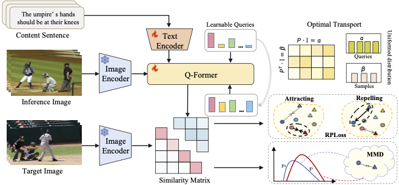

<div align="center">

# 🧠 MAPNet: Multi-Schema Proximity Network for Composed Image Retrieval  

**ICCV 2025**

<a href="https://openaccess.thecvf.com/content/ICCV2025/html/Shi_Multi-Schema_Proximity_Network_for_Composed_Image_Retrieval_ICCV_2025_paper.html" target="_blank">
  
</a>
<a href="https://pytorch.org/" target="_blank">
  
</a>
<a href="https://github.com/your-username/MAPNet/blob/main/LICENSE" target="_blank">
  
</a>

---

### ✍️ Authors
**Jiangming Shi**<sup>1,2</sup>, **Xiangbo Yin**<sup>2</sup>, **Yeyun Chen**<sup>1,2</sup>, **Yachao Zhang**<sup>2</sup>, **Zhizhong Zhang**<sup>3</sup>, **Yuan Xie**<sup>2,3</sup>, **Yanyun Qu**<sup>2†</sup>  

† *Corresponding Author: [yyqu@xmu.edu.cn](mailto:yyqu@xmu.edu.cn)*

---

### 🏛️ Affiliations
<sup>1</sup> *Shanghai Innovation Institute* <sup>2</sup> *Xiamen University* <sup>3</sup> *East China Normal University*

</div>

---

## 📖 Overview

**Composed Image Retrieval (CIR)** aims to retrieve a target image using a **composed query** — a *reference image* and a *textual modification*.  
This better reflects user intent than single-modal queries but presents two key challenges:

1. **Insufficient multi-schema interaction** – existing methods fail to capture complex object–attribute relationships.  
2. **Noisy negative interference** – mislabeled or semantically similar “negative” samples harm model convergence.

We introduce **MAPNet**, a robust and expressive network designed to overcome these limitations.  

<div align="center">
  
  <p><em>Overview of the proposed MAPNet architecture</em></p>
</div>

### 🧩 Key Contributions
- **Multi-Schema Interaction (MSI)**:  
  Leverages BLIP-2 Q-Former with *optimal transport* to dynamically model relationships between image and text schemas.  
- **Relaxed Proximity Loss (RPLoss)**:  
  Reduces the impact of noisy negatives via *similarity-aware reweighting* and *confidence denoising*.  

---

## 📊 Experimental Results

### CIRR Dataset (Test Set)
| Method | R@1 | R@5 | R@10 | R@50 | Avg. |
|:-------|:----:|:----:|:----:|:----:|:----:|
| SPRC (SOTA) | 51.96 | 82.12 | 89.74 | 97.69 | 81.39 |
| **MAPNet (Ours)** | **54.65** | **84.93** | **91.44** | **98.25** | **83.04** |

### FashionIQ Dataset (Validation)
| Method | Dress (R@10/R@50) | Shirt (R@10/R@50) | Toptee (R@10/R@50) | Avg. |
|:-------|:----------------:|:-----------------:|:------------------:|:----:|
| SPRC | 47.8 / 72.7 | 55.8 / 74.4 | 58.9 / 79.0 | 54.2 / 75.3 |
| **MAPNet (Ours)** | **51.2 / 74.1** | **56.4 / 75.2** | **59.6 / 79.3** | **55.7 / 76.2** |

### LaSCo Dataset (Validation)
| Method | R@5 | R@10 | R@50 | R@500 |
|:-------|:----:|:----:|:----:|:----:|
| SPRC | 22.21 | 30.43 | 55.10 | 88.17 |
| **MAPNet (Ours)** | **24.62** | **32.27** | **58.18** | **90.09** |

---

## ⚙️ Installation

### Prerequisites
- Python ≥ 3.8  
- PyTorch ≥ 2.0  
- CUDA ≥ 11.7 *(Recommended: NVIDIA RTX H100 80GB)*  

### Step 1. Clone the Repository
```bash
git clone https://github.com/shijiangming1/MAPNET.git
cd MAPNet
```

### Step 2. Install Dependencies
```bash
pip install -r requirements.txt
# includes: torch, torchvision, transformers, pillow, scikit-learn, numpy, tqdm
```

### Step 3. Prepare Datasets
```plaintext
data/
├── CIRR/          # from https://github.com/Cuberick-Orion/CIRR
│   ├── train/
│   ├── val/
│   └── test/
├── FashionIQ/     # from https://github.com/XiaoxiaoGuo/Fashion-IQ
│   ├── dress/
│   ├── shirt/
│   └── toptee/
└── LaSCo/         # from https://github.com/matanlevy/LaSCo
    ├── images/
    └── annotations/
```

---

## 🚀 Training & Evaluation

### Training
```bash
# CIRR
python train.py --dataset cirr --data_root ./data/CIRR \
  --lr 1e-5 --batch_size 32 --epochs 50 --ckpt_save_dir ./weights

# FashionIQ
python train.py --dataset fashioniq --data_root ./data/FashionIQ \
  --lr 2e-5 --batch_size 32 --epochs 50 --ckpt_save_dir ./weights

# LaSCo
python train.py --dataset lasco --data_root ./data/LaSCo \
  --lr 1e-5 --batch_size 16 --epochs 50 --ckpt_save_dir ./weights
```

### Evaluation
```bash
# CIRR
python eval.py --dataset cirr --data_root ./data/CIRR \
  --ckpt_path ./weights/mapnet_cirr.pth --metrics recall@1,recall@5,recall@10,recall@50

# FashionIQ
python eval.py --dataset fashioniq --data_root ./data/FashionIQ \
  --ckpt_path ./weights/mapnet_fashioniq.pth --metrics recall@10,recall@50
```

---

## 🧠 Model Details

| Component | Description |
|------------|--------------|
| **Backbone** | Frozen BLIP-2 (ViT-L/14 + BERT-base) |
| **MSI Module** | 32 learnable queries + Sinkhorn-Knopp optimal transport (τ=0.1) |
| **RPLoss** | Confidence threshold γ=0.5, kernel bandwidth σ=0.6 |
| **Alignment Loss** | Squared Maximum Mean Discrepancy (MMD²) |

---

## 🙏 Acknowledgments

This work was supported by:  
- **National Natural Science Foundation of China** (Nos. 62176224, 62176092, 62222602, 62306165)  
- **Science and Technology on Sonar Laboratory** (No. 2024-JCJQ-LB-32/07)  
- **Railway Sciences Project** (No. 2023Y1357)

---

## 📜 Citation
If you use this repository or find it helpful, please cite:

```bibtex
@inproceedings{shi2025mapnet,
  title={Multi-Schema Proximity Network for Composed Image Retrieval},
  author={Shi, Jiangming and Yin, Xiangbo and Chen, Yeyun and Zhang, Yachao and Zhang, Zhizhong and Xie, Yuan and Qu, Yanyun},
  booktitle={Proceedings of the IEEE/CVF International Conference on Computer Vision (ICCV)},
  year={2025}
}
```

---

<div align="center">

📩 **Contact:** [jiangming.shi@outlook.com](mailto:jiangming.shi@outlook.com)

⭐ If you find our work useful, please give us a star on [GitHub](https://github.com/your-username/MAPNet)!  
🚀 *Contributions, collaborations, and discussions are warmly welcomed.*

</div>
